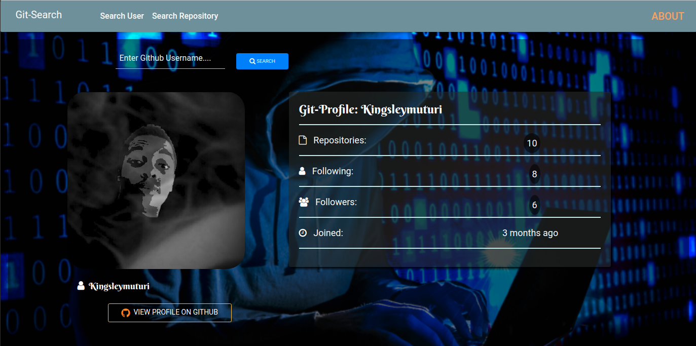

# Erudite Quotes

This project was generated with [Angular CLI](https://github.com/angular/angular-cli) version 9.1.7.
  
#### This is a webpage that has quotes to inspire people in their lives, Current version 2020
</table>
</tr>
</td>

#### By **Kingsleymuturi**
  
## Description
Erudite Quotes Website, is a website that inspires users by quotes written by other users as it allows one to input his or her own quote too.
## Access
* click the live link to be directed directly to the webpage:
https://Kingsleymuturi.github.io/Erudite-quotes
* you should see something similar to the following image

## Known Bugs
The quotes have no database to be stored yet.
### Development
Want to contribute? Great!

To fix a bug or enhance an existing module, follow these steps:

- Fork the repo
- Create a new branch (`git checkout -b improve-feature`)
- Make the appropriate changes in the files
- Add changes to reflect the changes made
- Commit your changes (`git commit -m 'Improve feature'`)
- Push to the branch (`git push origin improve-feature`)
- Create a Pull Request 

## Technologies Used
During the creation of this webpage I used HTML, CSS , Typescript. Generally, I used Angular CLI
## Support and contact details
In case of anything find me here: kingsleymuturi9@gmail.com feel free to communicate any issue with the webpage

### [LICENSE](https://github.com/Kingsleymuturi/Erudite-quotes/blob/master/LICENSE)
Copyright (c) 2020 [Kingsley Muturi ](https://github.com/Kingsleymuturi)
